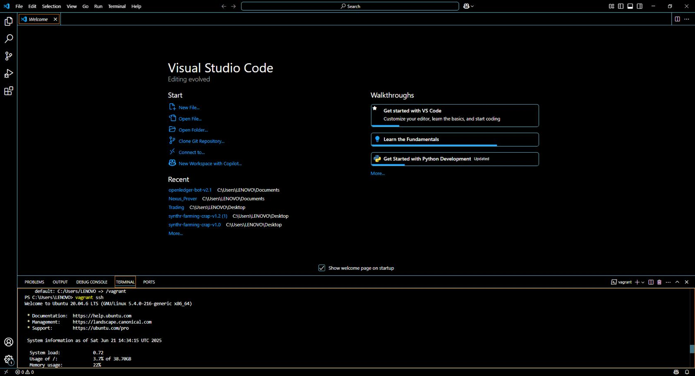
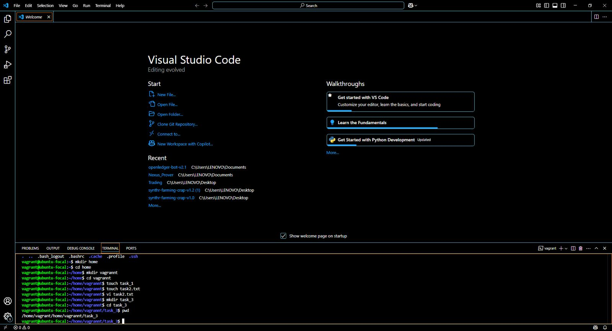
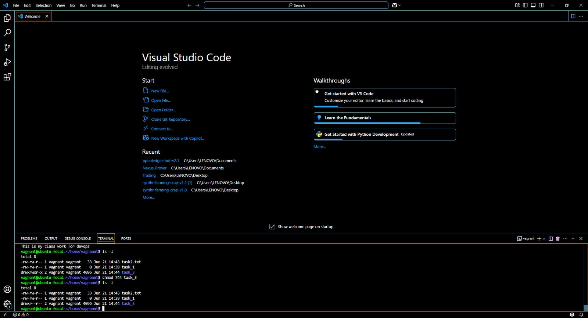
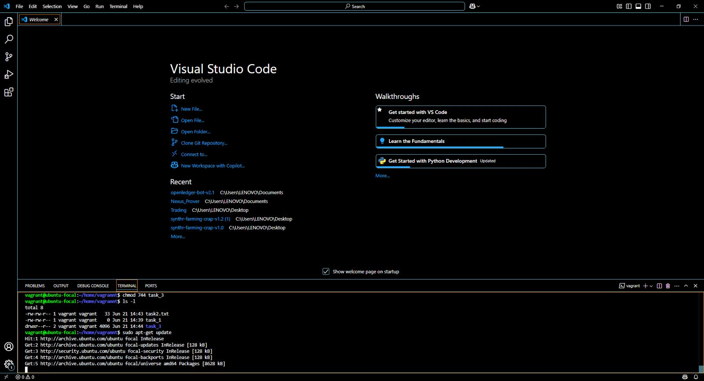
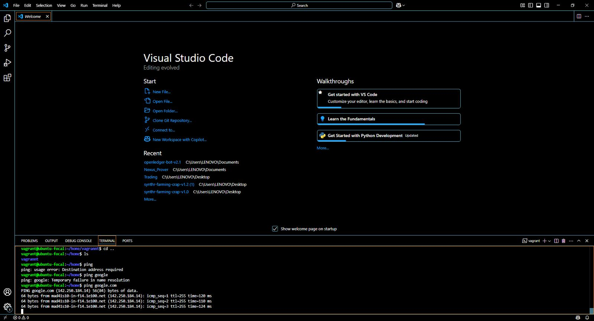

# vagrant-assignment
vagrant

The above is showing me SSH into my vagrant environment 

The image above is showing the file structure 

The Image above is showing the permission level

The image is showing the package been installed and version confirmation

The image above is showing the ping screenshot for google
